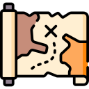

# Your assignment template

> Relevant epigraph or expectations-setting quote.

## Assignment Summary

Assignment summary.

### Assignment ToC

Describe parts of the assignment.

## Tips and Tricks

Relevant hints for moments when the assignment asks students to synthesize
or apply knowledge in a novel way.
